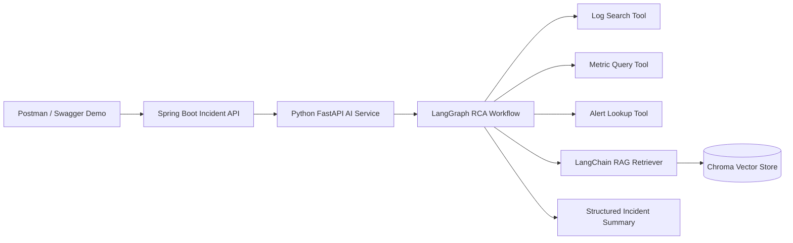

# Incident AI RCA MVP

Two-hour hackathon demo for agentic production incident analysis.

## What It Shows

- Java + Spring Boot backend API
- Python FastAPI GenAI orchestration service
- LangGraph multi-step agent workflow
- LangChain tools for log, metric, alert, and runbook lookup
- RAG over sample logs/runbooks using Chroma vector store
- Structured incident summary with root cause and actions

## Demo Flow

1. Start the Python AI service.
2. Start the Spring Boot API facade.
3. Call one REST endpoint from Postman/curl.
4. Show the response: agent trace, tool invocations, evidence, root cause, and actions.

## Open In VS Code

Open this workspace file:

```bash
code incident-ai-mvp/incident-ai-mvp.code-workspace
```

Recommended VS Code extensions:

- Extension Pack for Java
- Spring Boot Extension Pack
- Python
- REST Client

The project includes VS Code tasks for creating the Python virtual environment, installing AI dependencies, running FastAPI, testing Spring Boot, and running Spring Boot.

## Run Python AI Service

Python is required locally.

```bash
cd incident-ai-mvp/ai-service
python -m venv .venv
.venv\Scripts\activate
pip install -r requirements.txt
uvicorn app:app --reload --port 8000
```

Optional real LLM:

```bash
set OPENAI_API_KEY=your_key
```

Without `OPENAI_API_KEY`, the service uses deterministic summarization so the demo still works.

## Run Spring Boot API

```bash
cd incident-ai-mvp/backend
mvn spring-boot:run
```

Swagger UI is available after Spring Boot starts:

```text
http://localhost:8080/swagger-ui.html
```

## Try The Demo

```bash
curl -X POST http://localhost:8080/api/incidents/analyze ^
  -H "Content-Type: application/json" ^
  -d "{\"incidentId\":\"INC-1001\",\"query\":\"Checkout latency and payment failures\"}"
```

Direct Python service:

```bash
curl -X POST http://localhost:8000/analyze ^
  -H "Content-Type: application/json" ^
  -d "{\"incident_id\":\"INC-1001\",\"query\":\"Checkout latency and payment failures\"}"
```

You can also import `postman_collection.json` into Postman, or use `api-demo.http` with the VS Code REST Client extension.

## Build And Test

```bash
cd incident-ai-mvp/backend
mvn test
```

Python smoke test after starting FastAPI:

```bash
curl http://localhost:8000/health
```

Spring Boot smoke test after starting both services:

```bash
curl http://localhost:8080/api/incidents/health
```

## Push To GitHub

From inside `incident-ai-mvp`:

```bash
git init
git add .
git commit -m "Build incident AI RCA MVP"
git branch -M main
git remote add origin https://github.com/YOUR_USERNAME/incident-ai-mvp.git
git push -u origin main
```

## Architecture



